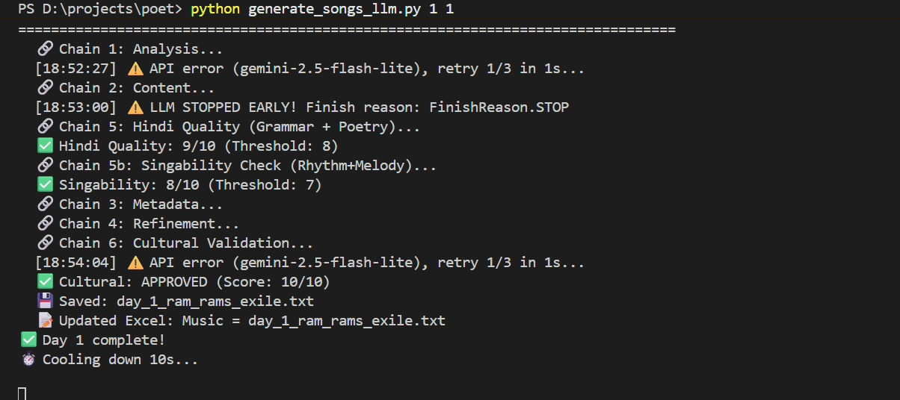

# Poet - AI Devotional Song Generator

[](LICENSE)
[](https://www.python.org/)

> **Do you think all AI-generated songs sound the same?**
>
> Generic lyrics. Western chord progressions wearing a sitar costume. Mantras that no pandit would recognize. That's what you get when you prompt a general-purpose AI and hope for the best.
>
> **Poet is different.** It was built specifically for Hindi devotional music — bhajans, qawwalis, folk songs — with an 8-stage pipeline that understands *rasa*, deity mythology, regional styles, and the difference between a Meera bhajan and a Sufi qawwali. Every song passes three independent quality checks before you ever see it: Hindi grammar, singability, and cultural accuracy.
>
> The result sounds like it was written by someone who actually knows the tradition. Because the AI was guided to.

Generate complete, ready-to-sing Hindi devotional songs using Google Gemini — lyrics, Suno AI style tags, YouTube title/description, and quality scores, all in one run.



📖 **[Complete Guide](COMPLETE_GUIDE.md)** - full documentation of all features and configuration  
🗺️ **[Roadmap](ROADMAP.md)** - planned improvements and future tasks

---

## Sample output

Here's a song generated entirely by Poet — lyrics, style tags, and all — then rendered in Suno AI:

**[Listen on Suno](https://suno.com/song/bfdb9012-ffe9-45d1-8aef-280a42175ce6)**

---

## What makes it different

| Generic AI prompting | Poet |
|----------------------|------|
| One model does everything | Flash model for cheap checks, Pro model for generation only |
| Same structure every time | 30+ style-matched structures (qawwali ≠ bhajan ≠ folk) |
| No cultural grounding | Deity mythology, authentic mantras, regional styles baked in |
| Hope it's singable | Dedicated singability check scores rhythm and melody fit |
| No safety net | 3 independent quality thresholds — regenerates if any fail |
| Costs pile up fast | ~$0.02/song; 100 songs for ~$2 |

---

## Features

- **Culturally grounded** - deity stories, authentic mantras, regional style awareness
- **30+ song structures** - style-matched templates: bhajan, qawwali, folk, meditative, sufi
- **3-layer quality pipeline** - Hindi grammar, singability, and cultural sensitivity scored separately
- **Dual-model cost control** - cheap Flash model for validation, Pro only when it matters
- **Iterative refinement** - fixes issues in place instead of regenerating from scratch
- **Suno AI ready** - outputs style tags formatted for direct paste into Suno
- **YouTube ready** - generates title, description, and tags alongside every song
- **Crash recovery** - automatic progress checkpoints; resume a 100-song batch mid-run

---

## Quick Start

### 1. Get a Gemini API Key
Visit **https://aistudio.google.com/app/apikey** and create a free API key.

### 2. Configure
```bash
cp .env.example .env
# Edit .env and set GEMINI_API_KEY=your_key_here
```

### 3. Install dependencies
```bash
pip install -r requirements.txt
```

### 4. Generate songs
```bash
# Single song (row 46 in First30Days.xlsx)
python generate_songs_llm.py 46 46

# Range of songs
python generate_songs_llm.py 1 10

# All songs marked in the spreadsheet
python generate_songs_llm.py
```

**Output:**
- Songs → `content/` folder (one `.txt` per song)
- Cost reports → `cost_reports/` folder
- Progress state → `.generation_progress.json` (auto-resumed on restart)

---

## Input Format

Songs are driven by an Excel spreadsheet (`First30Days.xlsx`). Each row represents one song with fields for deity, style, theme, mood, and mantras. See the included spreadsheet for the expected column structure.

---

## Cost & Performance

| Configuration | Cost/Song | Time/Song | Quality |
|--------------|-----------|-----------|---------|
| Dual-model (Flash+Pro) | $0.015–0.025 | 25–40 s | Excellent |
| Single Pro model | $0.080–0.100 | 60–90 s | Excellent |
| Single Flash model | $0.001–0.002 | 20–25 s | Good |

**100 songs with dual-model:** ~$2.00 and ~40 minutes.

---

## Output Files

Each song is saved to `content/day_X_name.txt` and includes:
- Song title and complete lyrics with section tags
- Suno AI style description and YouTube metadata
- Quality scores (Hindi, Singability, Cultural)

---

## Configuration

All settings live in `.env`. Copy `.env.example` to get started. Key options:

| Variable | Default | Description |
|----------|---------|-------------|
| `GEMINI_API_KEY` | - | **Required.** Your Google Gemini API key |
| `USE_DUAL_MODELS` | `true` | Flash for checks, Pro for generation |
| `FLASH_MODEL` | `gemini-2.5-flash-lite` | Model for validation/analysis |
| `PRO_MODEL` | `gemini-2.5-pro` | Model for song generation |
| `HINDI_THRESHOLD` | `8` | Min Hindi quality score (1–10) |
| `SINGABILITY_THRESHOLD` | `7` | Min rhythm/melody score (1–10) |
| `CULTURAL_THRESHOLD` | `7` | Min cultural sensitivity score (1–10) |
| `MAX_QUALITY_RETRIES` | `2` | Regeneration attempts on failure |
| `USE_ITERATIVE_REFINEMENT` | `true` | Refine vs regenerate on failure |

See `.env.example` for the full list with explanations.

---

## Troubleshooting

| Issue | Solution |
|-------|----------|
| Rate limit on Flash | Backup model auto-switches - check `FLASH_MODEL_BACKUP` in `.env` |
| Content too short | Verify `PRO_MODEL` is set and accessible in your region |
| Hindi 9/10 regenerating | Set `HINDI_THRESHOLD=8` (not 10) in `.env` |
| Cost report shows $0 | Enable `USE_DUAL_MODELS=true` in `.env` |

More help: [COMPLETE_GUIDE.md](COMPLETE_GUIDE.md)

---

## Publishing your songs

Poet generates lyrics and metadata — it does not produce audio itself. The recommended workflow:

1. **Generate audio** — paste the lyrics and Suno AI style tag from `content/` into [Suno.com](https://suno.com). Suno will render the full song with vocals and instrumentation.
2. **Upload to YouTube** — use the pre-generated YouTube title, description, and tags from the same output file. This is where devotional content finds its largest audience.
3. **Share on Suno** — Suno has a public discovery feed; keeping your songs public there builds a secondary audience.
4. **Wider distribution** — if you want Spotify / Apple Music, export the audio from Suno and use a distributor like [DistroKid](https://distrokid.com) or [TuneCore](https://www.tunecore.com) (~$20/year for unlimited uploads).

---

## Contributing

See [CONTRIBUTING.md](CONTRIBUTING.md) for how to report bugs, request features, and submit pull requests.

---

## License

MIT - see [LICENSE](LICENSE).
